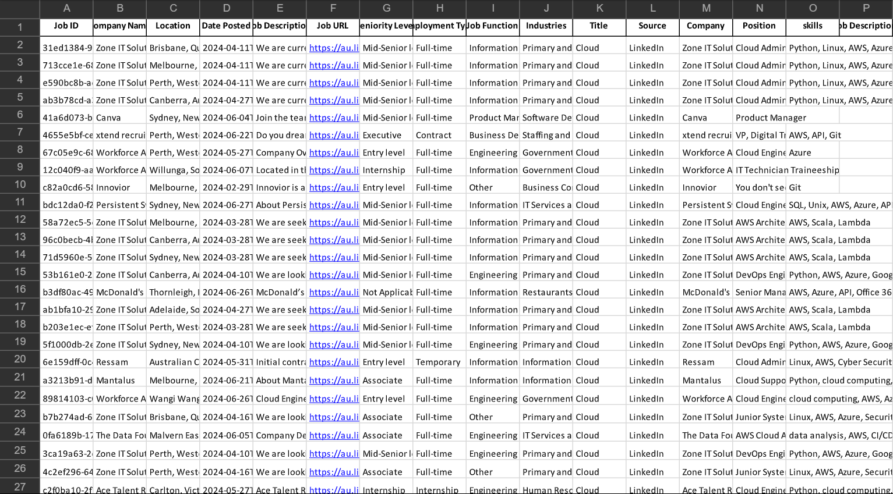
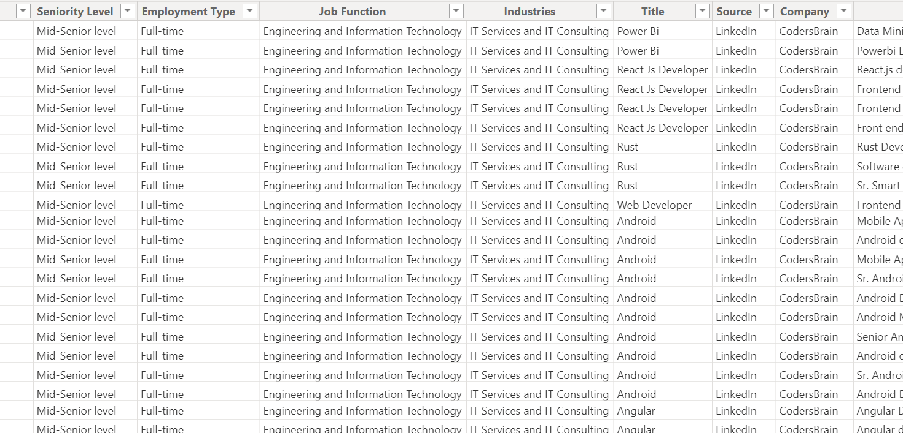
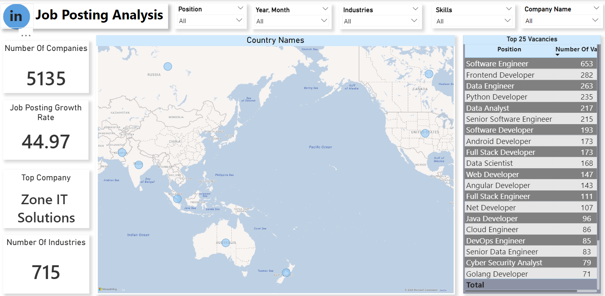

## Project Overview

- **Data Scraping:**
  - Utilized Python libraries Selenium and BeautifulSoup to scrape data from LinkedIn.
  - Collected relevant professional and industry data with a focus on accuracy and completeness.
  
- **Data Cleaning:**
  - Employed Pandas for thorough data cleaning and preparation.
  - Addressed missing values, corrected inconsistencies, and transformed the data into a structured format.

- **KPI Development:**
  - Created custom Key Performance Indicators (KPIs) based on the cleaned data.
  - Developed insights and visualizations to reveal trends and patterns within the LinkedIn dataset.
  
- **Project Outcome:**
  - Demonstrated end-to-end data handling capabilities, from web scraping to KPI creation.
  - The repository showcases the complete process, highlighting the use of Python for data-driven decision-making.

## Images

